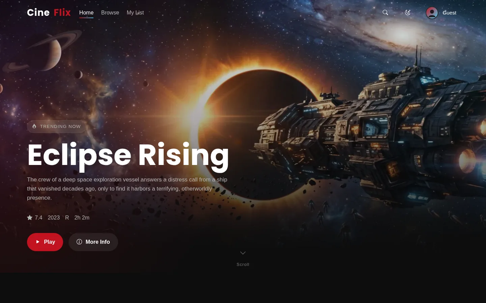
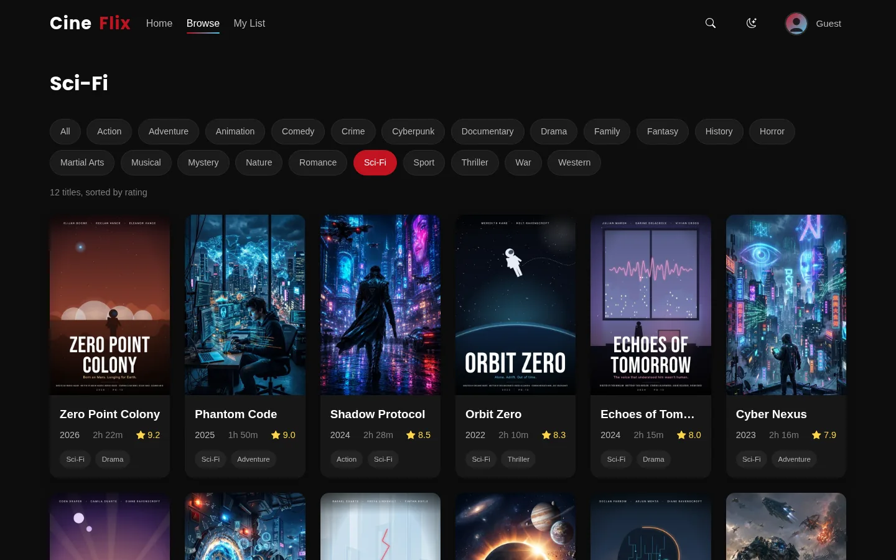
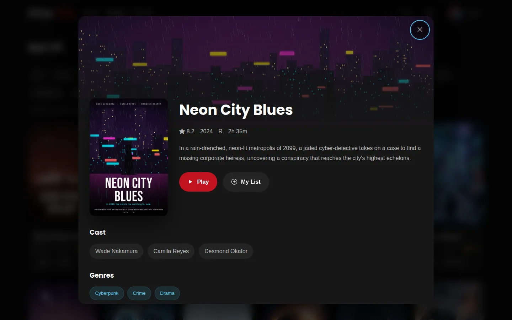
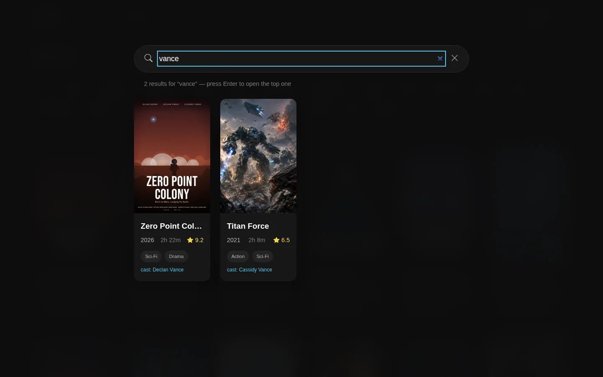
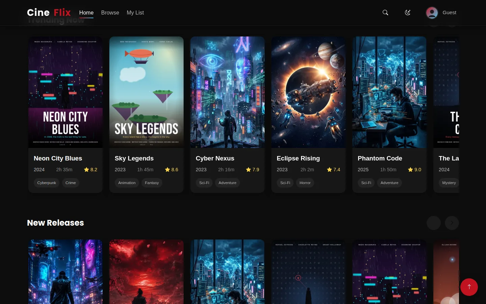
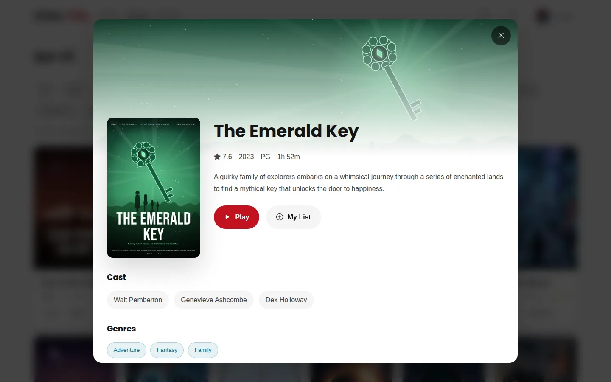
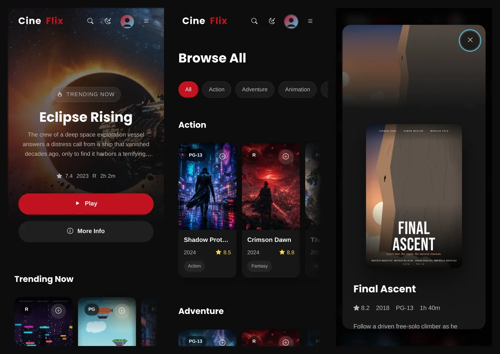
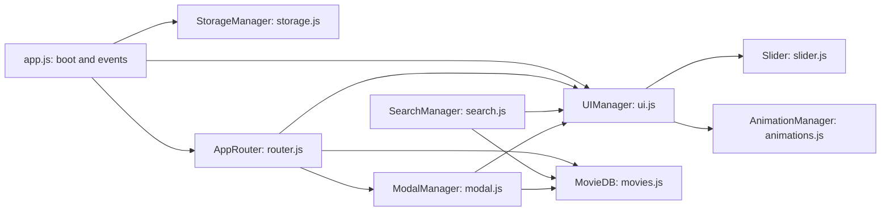

# CineFlix UI

A streaming-platform interface built from scratch with **HTML**, **CSS** and **vanilla JavaScript**: no framework and no build step. Browse a catalog of 36 films, search by title, cast or genre, keep a watchlist, and switch between dark and light themes on any screen size.




> **Live demo:** coming soon on GitHub Pages.
> CineFlix is a portfolio project, not a real streaming service. The catalog is sample data with invented cast and crew names, and there's no video playback.

---

## Features

### Browsing
- **Home page** with a featured hero banner and curated rows: Continue Watching, Recently Viewed, Trending Now, New Releases, Popular, Top Rated, and genre rows
- **Browse page** with 22 genre filters; each filter has its own link, e.g. `#/browse/Sci-Fi`
- **Movie details** in a dialog with cast, genres, director, writers, awards, box office and "More Like This" recommendations
- **Shareable links** for every page and movie; the browser's back and forward buttons work throughout

### Search
- Searches **titles, cast, directors, genres and years**, ranked by relevance
- Multi-word queries narrow results (`vance drama`), and each result shows why it matched
- Press `/` anywhere to search and `Enter` to open the top result

### Personal
- **My List:** save movies with one click
- **Continue Watching:** pressing Play records demo progress, and each card can be removed from the row
- **Recently Viewed:** the last 15 movies you opened
- **Dark / light theme**
- All of the above is saved in the browser with `localStorage`

### Design
- Responsive from 320px phones to large desktops, with a separate touch layout (tap a card to open it)
- Artwork for all 36 titles: a poster and a wide banner each
- Rows fade at the edge to show there's more to scroll, and page changes fade in
- Loading, empty and not-found states

### Accessibility
- Every action is keyboard-accessible; card buttons show on focus, not just on hover
- Focus stays inside the open dialog or search, and `Esc` closes the top-most layer first
- Skip link, labelled controls, `aria-current` navigation, and search results announced to screen readers
- Focus moves to the new page heading on navigation
- Honors `prefers-reduced-motion`

### Performance
- All images are WebP. Posters are sized for how large they're shown (500×750), so the whole set of 72 images is about 3.4 MB
- The hero image loads first; card images load only as they scroll into view
- Images reserve their space before loading, so the page doesn't jump
- No framework or bundle: one small routing library plus the app's own scripts

---

## Preview

| Browse by genre | Movie details |
| --- | --- |
|  |  |
| **Search** | **Movie rows** |
|  |  |
| **Light theme** | |
|  | |

**On a phone**



---

## Getting Started

Clone the repository:

```bash
git clone https://github.com/harshraj-31/cineflix-ui.git
cd cineflix-ui
```

Then either:

- **Open `index.html`** directly in your browser, or
- **Serve it locally** (closer to how it runs when deployed):

  ```bash
  python -m http.server 8000
  ```

  and visit `http://localhost:8000`.

There's nothing to install. An internet connection is needed for the fonts, icons and routing library, which load from public CDNs.

---

## Keyboard Shortcuts

| Key | Action |
| --- | --- |
| `/` | Open search |
| `Enter` (in search) | Open the top result |
| `Esc` | Close the dialog, search or menu (top-most first) |
| `Tab` / `Shift+Tab` | Move between controls; stays inside an open dialog |

## Routes

| URL | View |
| --- | --- |
| `#/` | Home |
| `#/browse` | Every genre as a row |
| `#/browse/:genre` | One genre as a grid, sorted by rating |
| `#/my-list` | Saved movies |
| `#/movie/:id` | Movie details, opened over the current page |

Routing is hash-based (`#/...`), so it works when opened as a local file and on static hosts like GitHub Pages without any server setup.

---

## How It Works

Each feature lives in its own module, written as a self-contained function that exposes a small API. The scripts load in dependency order from `index.html`, with no bundler.



A few design decisions worth knowing:

- **One click handler for the whole app.** Buttons declare what they do with `data-action="play | info | favorite | remove-continue"`, and a single listener in `app.js` handles them. Cards are re-created on every page change and never need re-binding.
- **Movie details are a route.** Opening a movie updates the URL to `#/movie/:id`, so details can be bookmarked or shared and the back button closes them. Closing a shared link returns to Home instead of leaving the site.
- **Rendering goes through `UIManager`.** Pages are built as document fragments and swapped into `#view-root` in one step. Every piece of movie data is escaped before it goes into markup.
- **Missing artwork is covered.** If an image file is ever missing (for example, a new movie added before its art exists), a listener draws a poster or banner in that movie's own colours instead of showing a broken image.

### Saved data

| `localStorage` key | Holds |
| --- | --- |
| `cineflix-favorites` | IDs of movies in My List |
| `cineflix-continue-watching` | Movie ID, progress and last-watched time |
| `cineflix-recently-viewed` | The last 15 movies opened |
| `cineflix-theme` | `dark` or `light` |

### Adding a movie

Add an entry to the `movies` array in `js/movies.js`. Its ID comes from the title (`"The Glass City"` becomes `the-glass-city`), and the app looks for:

- `assets/posters/<id>.webp` (500×750)
- `assets/hero/<id>.webp` (1920×815)

Until those files exist, generated artwork is shown in their place.

---

## Project Structure

```text
cineflix/
├── assets/
│   ├── hero/              # 1920x815 banner images (.webp)
│   ├── posters/           # 500x750 poster images (.webp)
│   └── profile-avatar.svg
├── css/
│   ├── variables.css      # design tokens, dark + light themes
│   ├── style.css          # base, buttons, footer, toasts, grids, empty states
│   ├── navbar.css         # navbar, mobile menu, search overlay
│   ├── hero.css           # featured banner
│   ├── cards.css          # movie cards, rows, sliders
│   ├── modal.css          # movie details dialog
│   ├── animations.css     # keyframes, scroll reveal
│   ├── responsive.css     # breakpoints, reduced motion
│   └── utilities.css      # helper classes
├── js/
│   ├── utils.js           # DOM helpers, artwork generator, scroll lock, focus trap
│   ├── storage.js         # StorageManager: favorites, progress, history, theme
│   ├── movies.js          # MovieDB: catalog data, filters, search
│   ├── ui.js              # UIManager: navbar, footer, hero, cards, rows
│   ├── router.js          # AppRouter: routes and page rendering
│   ├── slider.js          # Slider: row arrows and edge fades
│   ├── search.js          # SearchManager: search overlay
│   ├── modal.js           # ModalManager: movie details dialog
│   ├── animations.js      # AnimationManager + Toast
│   └── app.js             # entry point and app-wide event handling
├── docs/
│   └── screenshots/       # images used in this README
├── index.html
└── README.md
```

---

## Tech Stack

- **HTML5**: semantic landmarks and ARIA where needed
- **CSS3**: custom properties for theming, Grid and Flexbox, `:has()`, `:focus-visible`, CSS masks
- **JavaScript (ES6+)**: modules written as IIFEs, `IntersectionObserver`, `ResizeObserver`, History API
- **[Navigo](https://github.com/krasimir/navigo)**: hash-based routing (the only JavaScript dependency)
- **[Bootstrap Icons](https://icons.getbootstrap.com/)** and **[Google Fonts](https://fonts.google.com/)** (Poppins, Inter)

Built for current versions of Chrome, Edge, Firefox and Safari.

---

## Roadmap

- [x] Responsive home page, hero and curated rows
- [x] Browse page with genre filters
- [x] Movie details with shareable links
- [x] Search across title, cast, director, genre and year
- [x] My List, Continue Watching and Recently Viewed
- [x] Dark and light themes
- [x] Keyboard, screen-reader and touch accessibility
- [x] Artwork for all 36 titles
- [x] Image optimization (WebP, right-sized posters, lazy loading)
- [x] UI polish across desktop, tablet and phone
- [x] Screenshots in this README
- [ ] Deploy a live demo on GitHub Pages

Ideas for later: trailer previews on hover, sorting options on Browse, and more categories.

---

## Credits

- 10 titles use photographic artwork; the other 26 use illustrated vector posters and banners created for this project.
- Routing by [Navigo](https://github.com/krasimir/navigo), icons by [Bootstrap Icons](https://icons.getbootstrap.com/), fonts from [Google Fonts](https://fonts.google.com/).
- Movie data is sample content for demonstration only, and cast and crew names are invented.

---

## Author

**Harshrajsinh Zala**

- GitHub: [@harshraj-31](https://github.com/harshraj-31)
- LinkedIn: [harshrajsinh-zala-118058244](https://www.linkedin.com/in/harshrajsinh-zala-118058244)

Built as a frontend project to practice responsive design, accessible UI and modular JavaScript architecture.
